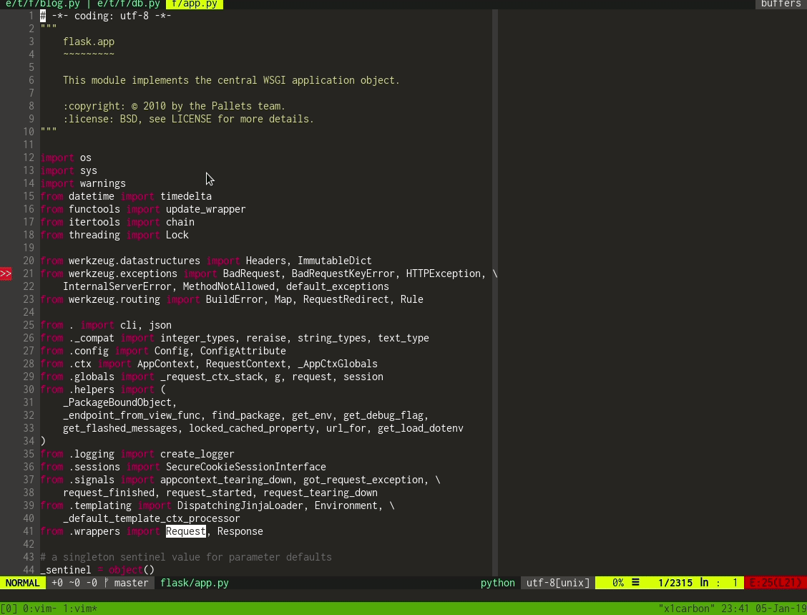
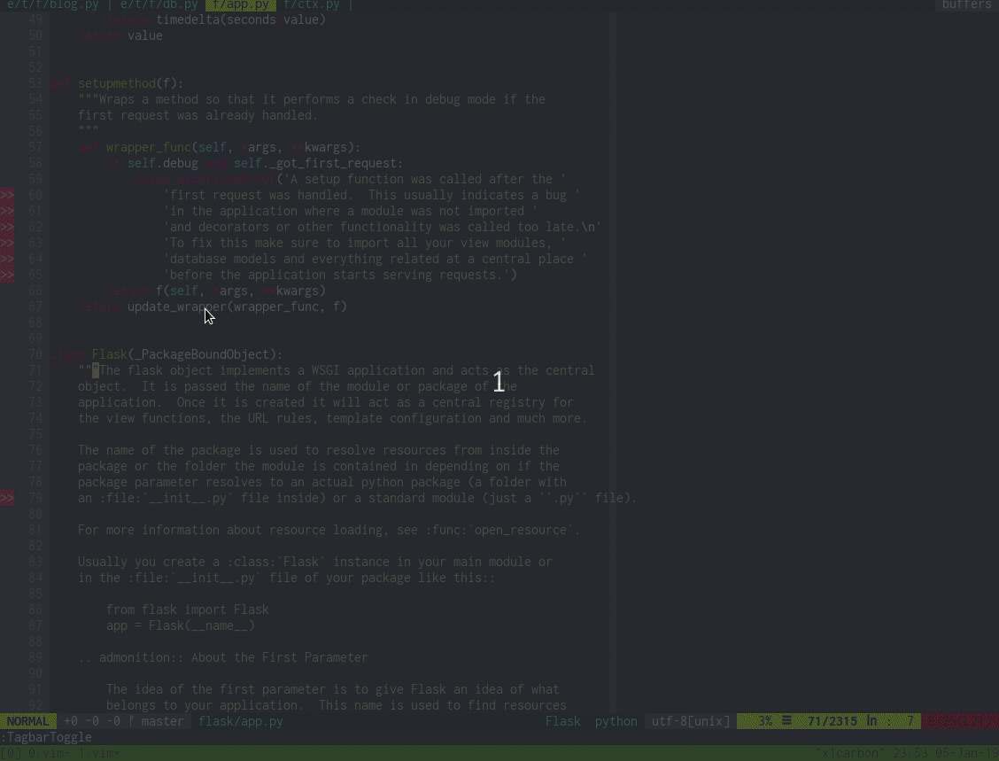

# Contents

This project aims to use Vim as a powerful and complete Python IDE. In order
to do that, we curated a list of awesome plugins available in the community and
provided an automatic installation procedure for this set.


## Installation


### Requirements for Ubuntu distros (Tested on Windows Subsystem for Linux)

```bash
sudo apt install libncurses5-dev libgnome2-dev libgnomeui-dev \
libgtk2.0-dev libatk1.0-dev libbonoboui2-dev \
libcairo2-dev libx11-dev libxpm-dev libxt-dev python-dev \
python3-dev git ctags
```

### Requirements for Fedora distros

```bash
sudo dnf install -y ctags git python python-devel \
python3 python3-devel tcl-devel
```

### Installation process

```bash
git clone https://github.com/rapphil/vim-python-ide.git && \
cd vim-python-ide && ./install.sh
```

## Features

Please check the available features and the plugins that enable them.

### Syntax Highlighting

Syntax highlighting for several languages, besides Python.

Powered by:

 * [vim-polyglot](https://github.com/sheerun/vim-polyglot)

### Color Themes

Several popular color schemes:

 * Monokai
 * Gruvbox
 * Much more

Powered by:

 * [vim-colorschemes](https://github.com/flazz/vim-colorschemes)


### Project Navigation

Easily navigate your project using:

 * File tree explore (Nerdtree)

 * Fuzzy finder based on the file names

 * File structure (classes, functions, methods).

Powered by:

 * [Nerdtree](https://github.com/scrooloose/nerdtree)
 * [Fzf](https://github.com/junegunn/fzf.vim)
 * [Tagbar](https://majutsushi.github.io/tagbar/)

### Powerfull Full Text search

 * Full text search based on both exact match and fuzzy finder capabilities
 * Extremely fast.


Powered by:

 * [Ripgrep](https://github.com/BurntSushi/ripgrep)
 * [Fzf](https://github.com/junegunn/fzf.vim)

### Real time linting

Lint source files in real time an check for errors and warnings.

Powered by:

 * [Ale](https://github.com/w0rp/ale)

### Code navigation

* Go to function definitions
* Check parameters and docstrings easily.

Powered by:

* [vim-gutentags](https://github.com/ludovicchabant/vim-gutentags)
* [jedi-vim](https://github.com/davidhalter/jedi-vim)

### Code refactoring

Extract methods, variables and rename functions easily.

Powered by:

 * [jedi-vim](https://github.com/davidhalter/jedi-vim)
 * [rope-vim](https://github.com/python-rope/ropevim)

### Code completion

Use hints and dialog boxes to speed your development using code completion.

Powered by:

 * [jedi-vim](https://github.com/davidhalter/jedi-vim)

### Snippets

Snippets save time while you type and creates standardization for your code.

Powered by:

 * [vim-snippets](https://github.com/honza/vim-snippets)
 * [ultisnips](https://github.com/SirVer/ultisnips)

### Git Integration

Perform git operations and highlight changes in the repo.

Powered by:

 * [vim-fugitive](https://github.com/tpope/vim-fugitive)
 * [vim-gitgutter](https://github.com/airblade/vim-gitgutter)

## Key bindings

| Action                   | Mode             | key binding     |
|--------------------------|------------------|-----------------|
| Toogle Nerdtree          | Normal           | `crtl + n`      |
| toogle Tagbar            | Normal           | `f8`            |
| Look for file            | Normal           | `crtl + p`      |
| Goto definition          | Normal           | `crtl + ]`      |
| Show docstring           | Normal           | `K`             |
| Extract method           | Normal/Visual    | `crlt + c r m`  |
| Auto complete            | Insert           | `crtl + space`  |
| Expand snippet           | Insert           |`tab`            |

## Commands

| Command Description            | Command        |
|--------------------------------|----------------|
| Look for string                | `:Rg <string>` |
| git status                     | `:Gstatus`     |
| git diff                       | `:Gdiff`        |
